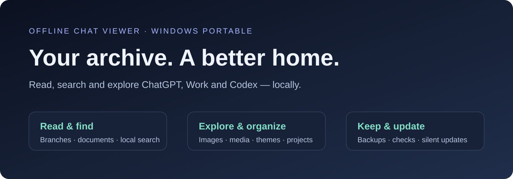
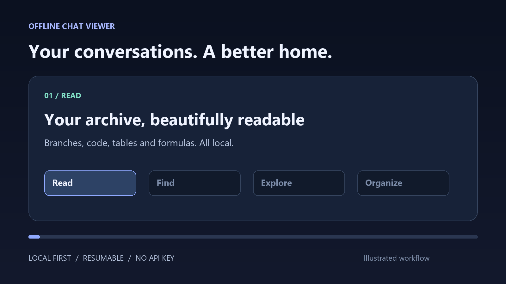
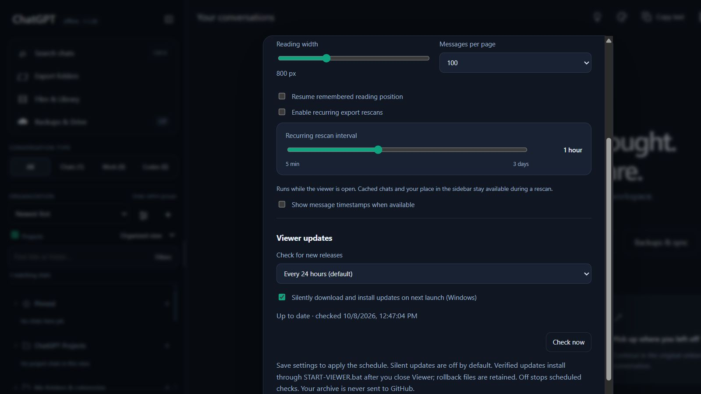

<div align="center">

# Offline Chat Viewer
### Your archive, beautifully readable. Entirely yours.

[](https://github.com/kitomisaitichi-design/chatgpt-viewer/releases/latest)
[](https://github.com/kitomisaitichi-design/chatgpt-viewer/actions/workflows/release.yml)


**[Download Windows ZIP](https://github.com/kitomisaitichi-design/chatgpt-viewer/releases/latest) · [Get started](#get-started) · [Feature catalog](#feature-catalog) · [Updates](#updates-on-your-terms) · [Release notes](release-notes)**

</div>



Read, search and organize saved **ChatGPT, ChatGPT Work and Codex** conversations in a familiar local interface. Explore branches, documents, images and media; keep your place; organize your archive; and back it up without sending your chats to a hosted reader.

The Windows download includes **Python and offline rendering assets**. Standard reading needs no installer, subscription, API key, CDN or package setup. Optional online features remain under your control.

## A quick tour



*1600 × 900 illustrated feature tour. These are explanatory visuals, not a recording of a personal archive. Full-resolution assets are linked directly above.*



*Actual Viewer Settings with demonstration data. Check schedules and silent installation are independent of backups and export rescans.*

## Get started

1. **Download** the latest Windows ZIP and extract the complete folder to a writable location.
2. **Launch** `START-VIEWER.bat`. Python is included; there is no required Python installation.
3. **Choose an export folder.** For ChatGPT Exporter, select its complete backup root, including `json`, `markdown`, indexes and `attachments`.
4. **Read and search.** Pick a chat, explore its saved branches, open attachments and organize the sidebar.

Keep `.viewer-data` when updating in place. Shared preferences live separately under `%LOCALAPPDATA%\OfflineChatViewer`; keep the old application folder or updater rollback copy until the update works.

## Feature catalog

### Read the whole conversation

- Import ChatGPT Exporter folders, official ChatGPT exports, readable Markdown/JSON conversations and supported explicit-role Codex session JSONL.
- Distinguish **Chats**, **Work** and **Codex** using saved source evidence; apply explicit type corrections where needed.
- Browse saved branches and message versions, model metadata, timestamps and source links.
- Render Markdown, headings, lists, code with copying/highlighting, formulas, tables, citations and supported saved charts/widgets.
- Preserve table link labels and source citations from supported structured OpenAI markup; open saved source URLs and inspect multi-source details.
- Keep literal code examples intact rather than interpreting them as rich content.
- Load messages in bounded pages, preserve reading positions and reuse recently opened conversation content.
- Jump to the top or bottom, navigate search results, copy conversation text and download source data.

### Find what matters

- Fast local text search across saved chats, with phrase and title matching, result sorting and filters.
- Find within a conversation and navigate matching messages.
- Find inside supported documents, including repeated next/previous traversal, a match counter, case sensitivity, whole words, regex and highlight-all controls.
- Keep document find controls open until you close them, close the viewer or change threads.
- Optional **Semantic** and **Hybrid** search use a local multilingual embedding engine. Initial setup downloads the engine/model; subsequent searches keep chat content on the device.
- Reuse indexes, extracted document text and cached previews to avoid repeating expensive work.

### A sidebar that fits your archive

- Organized sections for pins, bookmarks, native ChatGPT projects, local folders/categories, Chats, Work and Codex.
- Keep native project membership separate from local organization and disk source folders.
- Set section priorities, visibility, nesting, initial row counts, collapsed folders, compact rows, dates and count display.
- Sort by title, created/updated time or manual order; use per-folder sorting and drag/reorder controls where supported.
- Rename display aliases, add colors, pin/bookmark chats, keep sticky chats, and filter by type, dates, title, folder or untitled state.
- Expand long sections with **Show more**, retain context while scans run, and preserve layout across restarts/versions.
- Reversible **Trash** with search, selection, select-all, bulk restore and reviewed deletion actions.

### Documents, images and rich media

- File cards show real names, available sizes/types and saved/unavailable state; import or link an already downloaded copy when supported.
- Preview supported PDF, Office, Markdown, text/code, spreadsheet and HTML documents with local renderer assets and appropriate fallback actions.
- HTML previews use the viewer's restricted rendering path; document markup is not unrestricted app code.
- Zoom and search documents; use raw/text views where supported.
- Browse available images in the same thread with zoom/fit, source-prompt navigation, previous/next looping, and translucent top/bottom hover controls that skip missing files.
- Preserve legacy image rendering for legacy syntax. Supported new structured image blocks render as **one themed collection**, with adaptive section/card layouts, captions, sources and shared loading/availability status.
- Show honest missing-preview cards and retained source links instead of pretending unavailable files loaded.
- Hide redundant attachment/media reference text when the corresponding content is represented by a rendered card.
- Play supported **MP3, MP4, OGG, WAV, M4A/MA4 and MIDI** with modern theme-aware controls. Browser codec support still determines playback for encoded media; MIDI uses local synthesis.
- Use play/pause, seek, volume, speed, repeat and thread playlist controls; video fullscreen/Picture-in-Picture depend on browser support. Audio visualizations reflect playback rather than invented media metadata.

### Make it comfortable

- Alphabetically ordered, scrollable theme picker with **Amber, Aurora, ChatGPT dark, Cobalt, Forest, Light, Lavender, Midnight, Pure black, Rose, Sepia and Slate**, plus custom colors.
- Adjust accent, background, sidebar and text colors, font size and reading width.
- Configure messages per page, timestamps, remembered reading position and recurring export rescan intervals.
- Theme-aware dialogs, file cards, media controls, search panels and progress states.
- Subtle activity animation respects reduced-motion preferences; deletion progress scrolls automatically and completed items leave the active queue.

### Backups and portability

- Local backups and snapshots retain conversation data and available linked files with verification and manifests.
- Selective ZIP export and full backup-folder workflows; avoid treating transcript-only packages as complete attachment backups.
- Scheduled backup controls, saved queue progress, clear status and recovery diagnostics.
- Optional Google Drive delivery with separate account setup; local backup operation remains available without it.
- Optional compatible Exporter integration uses existing catalogs and shared file layouts; source disappearance does not erase verified local copies.
- Preserve preferences, organization and source provenance across version changes.

### Optional native ChatGPT connection and deletion

- **Connect** opens an app-owned native ChatGPT sign-in window using WebView2. A fresh authenticated response establishes Connected state; ordinary reading does not need this connection.
- Reopen the same private session using Account/Sign in; keep login data outside exported backups and release packages.
- Review the exact deletion set before running. Back up available source content first and compare the live conversation graph with saved JSON before deleting remotely.
- Keep one queue owner, shared pacing and Retry-After cooldowns; verify uncertain mutations before retrying.
- Label an already unavailable remote conversation truthfully and support receipt-based local cleanup without repeating remote deletion.
- Remove only verified, owned and unshared local attachments; retain changed/shared files and expose actionable errors.
- Queue native Codex session removal until Codex closes; preserve private recovery and prevent rediscovery through stable session exclusions. Referenced workspace files are not owned chat files.

## Updates on your terms

**New in 1.1.28:** open **Settings → Viewer updates** and choose:

| Release checks | Schedule |
| --- | --- |
| Every 12 hours | Twice daily |
| **Every 24 hours (default)** | Daily |
| Every week | Every seven days |
| Off | Scheduled checks disabled; Check now remains available |

Schedules persist across restarts and versions. Checks run while Viewer is running, even if the browser tab is closed. They contact this repository's public GitHub releases API without sending chats, filenames or archive contents. Errors remain visible without stopping reading, rescans or backups.

**Silent updates are optional and off by default.** Enable the checkbox and save Settings to download new Windows releases in the background. The updater verifies the published SHA-256, validates archive paths and stages files locally. Installation happens the next time you launch **START-VIEWER.bat**, after the existing Viewer closes. It keeps rollback copies of replaced app files and leaves `.viewer-data`, backup archives, optional models and the native login profile intact. Turn silent updates off to cancel a staged installation. Off disables automatic checks; a manual check can still stage an update when silent updates are enabled.

Silent installation requires the standard writable Windows installation and launcher. Source/non-Windows users can use release checks and install manually. Closing the browser tab alone does not necessarily stop the local Viewer server; stop its console/server before relaunching to install. If files are locked or an update cannot be applied, the existing app starts and the diagnostic is retained.

## Privacy and boundaries

Standard reading, rendering and local backups work offline. Optional release checks, semantic-engine setup, native ChatGPT operations and Google Drive delivery use their respective online services. Your archive is not uploaded to GitHub for update checks.

This project is independent of OpenAI. A saved archive can only display data and files that actually exist; source links cannot recreate missing originals. Keep independent backups before irreversible deletion.

## Troubleshooting

| Issue | Where to start |
| --- | --- |
| No chats appear | Choose the complete export root; resume/check scan status and source format |
| An attachment says unavailable | Confirm its bytes exist locally; link/import the downloaded copy or retain the source link |
| Media will not play | Check its real format and browser codec support; open/download the original |
| Native connection fails | Reopen Connect/Sign in and inspect the actual WebView2/authentication error |
| Deletion needs attention | Inspect the row; newer graphs or changed files require review rather than silent deletion |
| An update cannot be installed | Check write access and `.viewer-data/update-result.json`; close Viewer and relaunch through START-VIEWER.bat |
| Need to roll back | Stop Viewer, restore the previous app files from `.viewer-data/update-rollback`, and retain a matching private data backup |

**[Detailed reference and historical validation](docs/REFERENCE-AND-HISTORY.md) · [Google Drive setup](GOOGLE-DRIVE-SETUP.md) · [License](LICENSE) · [Source/release notes](release-notes)**

## Development

```sh
python -m unittest discover -s tests -q
node tests/check_rendering.js
python scripts/package-release.py
```

Release CI checks the exact triggering commit, runs backend and renderer tests, and produces the portable ZIP plus SHA-256 checksum. Public packages exclude personal archives, credentials and private fixtures. Test results, illustrated demos and live UI verification are distinct; release notes record what was actually checked.
