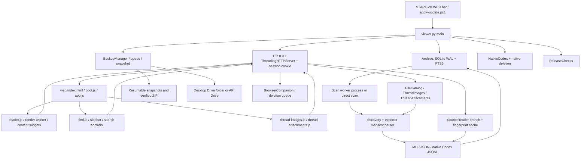

# Offline Chat Viewer 1.1.28 — implementation and validation reference

Audit date: 2026-10-09. Scope: the *portable Windows release* rooted one directory above this document, rather than an assumed development checkout. Sources are cited as `filename:line-range` against the unchanged 1.1.28 package. This document was added as an exploration deliverable; application implementation, user preferences, original archives, backup ZIPs, and `.viewer-data` were not modified.

**Post-audit implementation update (2026-10-09):** The later sections retain the *originally observed defects* as reproducibility evidence, not claims that every defect remains open. Source fixes were subsequently implemented for the confirmed races and recovery problems and validated with the updated suites. See **Section 14 — Implemented fixes and validation**. Source locations preceding Section 14 refer to the originally audited release; some line numbers have moved after edits. User archives and `.viewer-data` remain untouched.

## Evidence key and test boundaries

- **EXECUTED** — exercised with ephemeral Python fixtures, isolated SQLite databases, isolated localhost server, or updater copies in a disposable Windows directory.
- **TRACED** — source and caller path inspected on both sides of a contract; reported as an implementation property, not a load-test result.
- **RACE / SOURCE-DEMONSTRATED** — an interleaving is possible from the actual call and state transitions; where a simulated or actual interleaving was executed it is separately identified.
- **UNTESTED** — exercised neither in the packaged test suite nor in this audit; retain as coverage debt.

The shipped ZIP has no `tests/`, `scripts/`, `.git/`, Node executable, or `package.json`. The README's development commands (`README.md:149-157`) therefore cannot be reproduced from this package. The previous map established that 31 Python modules parse, a small importer fixture succeeds, and the already-running v1.1.28 health endpoint answers successfully. This audit goes beyond that baseline. Every Python fixture used a fresh `tempfile.TemporaryDirectory`, with `Archive(data_dir=<temporary path>, background_process=False)`; API tests bound another temporary `Server(('127.0.0.1',0), archive)`, with its own cookie. No private message content was read in the tests. Re-run the retained probes from the application root with `runtime\python.exe -B docs\verify-architecture-v1.1.28.py`. The script reports known defects explicitly rather than treating them as desired long-term behavior.

## System execution and ownership map



**Ownership:** `viewer.py:294-345` owns the archive connection and schema, `viewer.py:1236-1263` builds the HTTP service and managers, `viewer.py:1600-1629` starts the processes/threads. `web/app.js:2-20` owns `S` (selected chat, messages, settings, generation, pagination); `web/reader.js:6-33,103-125` owns per-message formatting, worker jobs and DOM lifecycle. SQLite is an index and text copy; source MD/JSON/JSONL files remain provenance for branches and original assets.

### Startup and portable update path — TRACED

`START-VIEWER.bat:3-22` resolves to its own directory, invokes `apply-update.ps1` if `.viewer-data/pending-update.json` exists, and then chooses `.semantic-env/Scripts/python.exe`, bundled `runtime/python.exe`, `py -3`, or `python`. `viewer.py:1601-1617` constructs an archive under `.viewer-data` by default, optionally attaches shared preferences, enables the UI cache, binds an **ephemeral** localhost port, creates a URL with a per-server random token, starts schedulers/discovery, writes `session.json` and opens the browser. Closing a browser tab does not close that server. `viewer.py:1625-1627` owns graceful shutdown.

The HTTP listener is loopback-only (`viewer.py:1610`), and the initial `/?token=...` GET sets a port-named `HttpOnly; SameSite=Strict` cookie (`viewer.py:1369-1372`). Subsequent requests require the cookie and localhost Host value (`viewer.py:1335-1342`); POSTs also constrain `Origin` (`viewer.py:1524-1528`). Companion POSTs use a distinct secret header and extension-origin policy (`viewer.py:1511-1523`). Static assets are served from the resolved `web/` boundary (`viewer.py:1486-1503`).

Release checks use a bounded GitHub API response and scheduled interval (`release_checks.py:14-20,21-76`). Update staging downloads only expected GitHub release asset URLs, checks SHA-256, rejects unsafe or duplicate ZIP paths, validates the embedded `viewer.py` version and writes the pending marker atomically (`silent_update.py:9-52`). The PowerShell installer (`apply-update.ps1:1-51`) checks a recorded runtime owner, constrains the staged payload directory and per-file target paths, recomputes staged hashes, makes rollback copies, installs file-by-file and restores changed files if a subsequent copy fails. It retains a failed pending marker for a later retry and writes `update-result.json`. The installed `runtime/native/NativeConnect.exe` hash matches the bundled helper manifest's expected binary, and the declared C# source hash also matched the packaged source in the audit.

## 1. Archive discovery, import and precedence

1. **Request:** POST `/api/scan {path, up}` calls `Archive.request_scan` (`viewer.py:1533,590-596`). A new request sets the prior cancellation event, saves the scan root/upward depth/paused state and schedules `process_scan` (usual Windows path) or `scan` (isolated direct path). `stop_scan` records the paused state (`viewer.py:643-645`).
2. **Scope:** `discovery.scan_boundary:9-16` resolves a selected directory and 0–4 parent levels, stopping above drive-root traversal. `iter_documents:18-56` walks near folders first, excludes symlinks and standard caches/system directories, caps depth 24, folders 25,000 and candidate files 100,000, and emits MD/JSON/JSONL. The UI and backups share these boundary rules.
3. **Worker:** `viewer.py:597-626,1215-1234` starts a spawned process with a bounded status queue, flushes live discovered titles to `publish_sources`, respects cancellation, and reconciles the final catalog. `foreground_read` sets a shared multiprocessing event so the scanner's `yield_background` pauses during foreground reading (`viewer.py:627-636`).
4. **Manifests:** `exporter_bridge.py:7-45` normalizes aliases and merges sparse job/handoff/index entries without erasing richer `project`, `json` or `markdown` references. `read_metadata:47-65` caps metadata at 128 MiB, checks size/mtime consistency and caches a handful of fingerprinted metadata objects. `Archive.register_manifest:686-715` accepts only resolved paths within the scan boundary and records available/expected entries, allowing a title before the full conversation has been indexed.
5. **Discovery and indexing:** `Archive.scan:770-870` prioritizes metadata, fingerprints each file with mtime nanoseconds + size, skips unchanged known files, and prefers available JSON over duplicate Markdown. When duplicate JSON exports share an ID, saved source update timestamps help choose the newer source (`viewer.py:839-855`). A malformed source adds an error but does not delete previously indexed rows (`viewer.py:860-867`).
6. **Persistence:** `Archive.store:896-925` atomically replaces a chat's messages and corresponding FTS/title row mappings inside a SQLite transaction, updates the chat's source path/fingerprint and inserts visible-message chunks. The companion `scanned_files` table allows incremental rescans. Indexing the same intact export does not rebuild it; a changed fingerprint does.

**Caveats:** mtime+size fingerprinting is efficient but cannot detect a rewrite which preserves both attributes; it is a cache key, not an integrity hash. Importing a large official JSON array still parses the entire input in `read_items` (`viewer.py:755-769`), and indexing materializes messages plus many FTS chunks. The source reader also retains parsed raw data (`source_reader.py:49-71`) for active source/branch pages. These are meaningful large-archive memory costs; the background process isolates scanning from the HTTP process but does not eliminate memory consumption.

## 2. SQLite schema, migrations and state boundaries

`Archive.__init__:306-337` creates the WAL-mode SQLite archive with `chats`, `messages`, `organization`, JSON settings, manifest provenance, remote state, scan fingerprints, local-removal tombstones, vectors, and FTS5 `chunks`/`titles` plus row-ID bookkeeping. Indexed messages have `(cid,seq)` identity and visibility; `messages.extras` stores presentation/source/model metadata. Evolution is **additive column inspection**, presently `trashed`, `color`, `sticky`, `bookmarked`, `kind_override`, `extras`, `kind_evidence` and `source_updated` (`viewer.py:326-334`), followed by chat kind normalization.

`connect():338-345` uses one SQLite connection per context, 5-second busy timeout and transactional exit. `Archive.repair_cached_projects:382-396` repairs project labels from manifest metadata; `repair_cached_types:397-431` reads indexed assistant receipt/manifest/header metadata and marks its one-time repair setting. `enable_ui_cache:366-381` loads catalog and coverage on a background thread, while `publish_sources:451-472` merges staged titles into an in-memory catalog, preserving local organization.

`catalog:660-674` composes indexed and manifest-only rows with organization and remote-state annotations. `catalog_batch:543-561` limits response rows to 25 and approx. 16 KiB; `state:562-589` can return a revision-delta or a first-page catalog when a delta grows large. Frontend `web/app.js:53-90` hydrates in 25-row batches while keeping the active reader prioritized. The UI cache holds a **separate revision** and per-row revision bookkeeping; new code changing catalog fields must update both DB and this cache.

Deleting a local indexed chat is explicitly different from hiding it in Trash: `remove_local_chat:348-365` inserts a tombstone and removes chat/message/FTS/vector/manifest/organization rows transactionally, invalidates source/branch caches and carries deleted IDs into shared preferences. Ordinary `organize` and `organize_many` write only selected allowlisted fields (`viewer.py:717-752`) and preserve original source files.

**Preferences persistence:** `preferences.py:9-58` stores a version-independent profile in `%LOCALAPPDATA%/OfflineChatViewer/preferences.json` using Windows locking and atomic writes, whereas `.viewer-data/archive.sqlite3` stores indexed text and app-local settings. `preferences.attach:61-79` restores profile settings, organization and backup configuration. Backups, native login secrets and credentials have their own stores. Never assume copying `.viewer-data` alone migrates every cross-version preference or remote-session credential.

## 3. Source parsing, branch selection and paging

- **Input formats:** `viewer.py:223-261` parses ChatGPT JSON graphs (`mapping` and `current_node`) or flat message arrays, collects text/attachments/model receipts/presentation hints, infers chat type using metadata (`chat_types.py:9-65`), and stores visible vs tool/detail roles. `parse_md:267-292` splits `## User/Assistant/Tool/System` sections while respecting fenced-code blocks. `source_reader.py:16-41` accepts producer-validated native Codex session JSONL with an incomplete trailing active record tolerated; `native_codex.py:15-25` verifies the session metadata header.
- **Graph:** `active_nodes:55-63` follows parent pointers from a chosen/default leaf to root, guarding loops. `graph_context:72-103` traverses children to determine alternative visible user/assistant versions. `choose_version:952-962` chooses a descendant leaf for the requested alternate message; `branch_page:963-966` fetches that path without writing a new branch to the indexed DB. `/api/branches` emits leaf ID, timestamp, preview and selected flag (`viewer.py:1471-1474`).
- **Source-cache:** `SourceReader.entry:43-77` keys on resolved path, source mtime_ns, size and CID; coalesces concurrent same-key reads via a `Future`; keeps a 4-entry/nominal-192-MiB LRU and clears older fingerprints for the same path and CID. `rows:78-90` caches at most two branch views per entry. A changed file path/fingerprint yields fresh parsed rows; a branch not in the export is rejected.
- **SQLite vs source:** `Archive.foreground_page:480-494` chooses indexed SQLite rows if the known source fingerprint matches, else parses the changed source on demand via the small foreground reader pool. `Archive.page:926-945` supports `before`, `around`, `after`, `limit<=200` and `details` with `{messages,total,older,newer,first}`. `page_rows:95-102` implements the equivalent branch-source cursor semantics. `message_fragment:520-542` supplies remaining portions of a large message.
- **Response budget:** `bounded_message_page:1180-1213` clamps byte budget to 4–128 KiB, trims individual long texts, returns `text_complete=false,text_next,text_length`, reduces metadata sources and selects the nearest/leading/trailing message window. `web/reader.js:103-111` subsequently requests `/api/message-text?id,seq,offset,bytes,leaf`, checks monotonic offsets, and formats only once complete.

### Browser selection / paging lifecycle

`web/app.js:113-135` increments a selection request and generation, aborts the previous API controller, sets `S.selected` and leaf, and first requests five latest messages (or a 20-message window around the desired sequence). `renderProgressively:105-112` mounts in groups of five, preserving scroll position and checking generation between yields; `primeHistory:137` fills toward the configured page size. `loadPage:138-142` fetches older/newer windows, caps mounted message nodes to 300, trims the opposite end and corrects scroll. `rememberChat:100-102` keeps five warm selections with their DOM nodes and an associated catalog fingerprint.

Hash URLs `#chat=...&message=...&leaf=...`, remembered per-chat positions, tool-detail visibility and explicit branch toggles feed this same navigation path (`web/app.js:68-90,113-143,167-168`). An asynchronous response is valid only for the selected **conversation ID, leaf and source revision**; generation/AbortController covers many selection transitions but not every subordinate lookup (see risks).

## 4. Full-text, find and optional semantic indexing

Visible message text is split into 1,200-character chunks with a 200-character overlap (`viewer.py:1152-1154`); FTS5 `porter unicode61` indexes `chunks(cid,seq,title,text)` and `titles(cid,title)` (`viewer.py:309-324,916-922`). `Archive.search:967-1024` implements keyword/smart expansion, title/ID/manifest-only matching and optional semantic/hybrid branches. It groups token prefix matches, falls back to OR on sparse results, deduplicates by `(cid,seq)` and caps returned results at 180. A deliberately small, hardcoded `CONCEPTS` list is in `viewer.py:1145-1150`.

`phrase_search.py:47-147` implements exact phrase and typo-tolerant phrase modes: FTS obtains candidate chunks, then `near_phrase` verifies order, completion or spelling against original candidate text. Title matches are checked separately. `find_text.py:4-29` is a distinct, literal whitespace-tolerant scan across the selected conversation/branch, capped at 1,000 occurrences; it searches full SQLite message bodies or SourceReader branch rows. The in-chat UI lives in `web/find.js`, while cross-chat results and navigation live in `web/app.js:144-158`.

When semantic search is first selected, `request_semantic/build_semantic:1025-1061` can install optional local model assets, load a multilingual MiniLM encoder, clear/rebuild the `vectors` table from all FTS chunks in batches of 32, and mark readiness. `semantic_search:1068-1086` loads all embeddings into memory and computes cosine/dot ranks on CPU; hybrid mode combines ranked keyword and semantic hits. Unlike indexed text search, **semantic search currently scales its query memory and compute with all stored embeddings**, and rebuilding can overlap new scan writes. It requires a separate load/concurrency test; that was not run here.

## 5. Rendering, lazy lifecycle and media

`web/index.html:1` declares ordered deferred scripts; `boot.js:3-9` makes folder controls available ahead of full initialization and exposes a startup failure message. `app.js:187-190` wires controls, starts a periodic `/api/state` refresh and optional rescan clock. `reader.js:27-33` creates a rendering worker, prioritizes visible/selected jobs, times out failed worker startup or jobs, caches small rendered HTML in a bounded in-memory LRU and uses a separate highlight worker. `reader.js:58-67` parses generated HTML into an allowlisted DOM, strips attributes and unsafe tags, constrains external URLs and resolves local images through `/api/asset`. `reader.js:69-107` turns headings, code and tables into interactive fold/scroll/copy controls; `reader.js:116-125` uses `IntersectionObserver` to format near-viewport messages and releases/re-observes DOM on paging or a warm-chat switch.

Media references are detected from saved message metadata and readable text (`thread_images.py:12-27,40-98`). `ThreadImages.catalog` keys on source fingerprint, branch leaf and FileCatalog signature; groups repeated occurrences by target, includes Library-linked files and retains a bounded eight-catalog LRU. `ThreadImages.file:110-123` requires a cataloged image occurrence and validates actual raster magic bytes, not just the extension. `thread_attachments.py:37-125` extends the same occurrence model to documents/audio/video and saved local-copy selections, with candidate matching and source-size/mtime checks. The frontends (`web/thread-images.js:3-33`, `web/thread-attachments.js`) fetch catalogs lazily per selected chat/branch, mount thumbnails/cards by message sequence, and open zoomable image/document panels.

`library_files.py:8-12,19-118` accepts only manifest paths under known attachment directories, tracks source IDs/Library associations and historical state, filters removed conversation references, and delivers files only within the catalog root with expected size. Imported manual copies are staged and validated before replace (`library_files.py:119-160`). `viewer.py:1389-1417` exposes `/api/thread-images`, `/content`, `/api/thread-attachments`, `/content`, `/relative`, `/api/thread-markdown` and `/api/files`/content. Range requests and streaming for media are handled by `Handler.stream_file:1343-1366`.

Document HTML is sandboxed through `attachment-frame.html`, restricted with nonce-inlined pinned renderer scripts and `connect-src 'none'` (`viewer.py:1489-1502`); imported SVG/HTML/code are downloaded rather than executed inline by `/api/asset` (`viewer.py:1481-1485`). The frontend uses dedicated PDF/Office/text renderers and local search controls. Rendering is bounded by file preview and expanded-document limits (`thread_attachments.py:118-125`); browser codec support still governs real audio/video decoding.

### Core HTTP contracts

| Endpoint | Caller or producer | Main output / transition |
|---|---|---|
| `GET /api/state?since&priority` | `app.js refresh` | revision, initial/delta chats, scan, coverage, settings, semantic and removals; initial catalog limited to five |
| `GET /api/catalog?offset&limit&priority` | `hydrateCatalog` | up to 25 catalog rows, `nextOffset,total,revision` |
| `POST /api/scan`, `/api/stop-scan` | export controls | request/cancel scan, persist scan selection |
| `GET /api/messages?id&before/around/after&limit&details&leaf&bytes` | `openChat/loadPage` | bounded page with cursors, message/receipt/extras |
| `GET /api/message-text?id&seq&offset&bytes&leaf` | `Reader.fullText` | `text,next_offset,complete` |
| `GET /api/branches?id`, `/api/version?id&target` | branch controls | available leaves / target-dependent selected leaf |
| `GET /api/search?q&mode&type&category` | archive search UI | score-ordered hits `cid,seq,title,snippet`, mode, more, optional notice |
| `GET /api/find?id&q&leaf&details` | in-chat find | full-text offsets by `seq,role`, truncated flag |
| `GET /api/thread-images[ /content]`, `/api/thread-attachments[ /content]` | image/document widgets | occurrence catalogs and authenticated file streams |
| `GET /api/files`, `/api/files/content`, `/api/asset`, `/api/file-preview` | files/doc viewers | scoped Library list / safe stream / bounded preview |
| `POST /api/settings`, `/api/organize[-many]` | settings/sidebar | persisted settings and selected organization attributes |
| `GET /api/backup/status/preview`, `POST /api/backup/*` | backup UI | queue, snapshot, ZIP/delivery/retry/import management |
| `GET /api/delete-queue`, `POST /api/delete-queue/*` | deletion UI | review/action/verification state for remote or local removal |
| `POST /api/companion/poll,permit,result` | companion extension | secret-authenticated extension work queue and receipts |
| `GET /api/releases`, `POST /api/releases/check` | updates UI | saved update status and asynchronous release check |

The dispatcher is `viewer.py:1367-1504` for GET and `viewer.py:1510-1598` for POST; contract exceptions are serialized as HTTP 400 with `{error}`. File responses stream bytes, whereas JSON/text replies use `send`, optionally gzip-compressed (`viewer.py:1307-1334`). The normal browser `api()` wrapper uses a per-request timeout and an `AbortController` (`web/app.js:5-6`).

## 6. Backup, recovery, native services and companion boundaries

**Backup planning:** `BackupManager:168-250` keeps config in `.viewer-data/backup-config.json` and durability/queue state separately, supports source root + 0–4 levels, type selection, local ZIP and desktop-synced or API Drive delivery. `archive_backup.py:64-108` inventories source MD/JSON and linked assets within the export root, preserves paths and computes hashes. `backup_snapshot.py:12-93` captures immutable per-file copies with source before/after stat/inode checks, SHA-256, safe staging and durable capture manifests. Concurrent export writes cause a `SnapshotPending` retry while already-captured files are retained; a snapshot is expressly per file, **not a simultaneous whole-export transaction**.

**Packaging and import:** `archive_backup.py:110-133` writes a deterministic ZIP to `.partial`, verifies source bytes against expected hash and atomically replaces the completed slot. It adds file manifests, settings/index and an offline HTML browser. `extract_zip:135-166` rejects traversal, symlinks, duplicate paths, reserved Windows names and excessive count/expansion, then validates hashes against a recognized backup manifest. `BackupManager.import_zip:491-548` imports into its managed imports directory, compares existing vs imported timestamps/counts, preserves newer indexed material and restores only allowlisted settings when explicitly requested.

**Queue/schedules:** `backup_queue.py:7-56` uses a cross-process job lock plus atomic queue writes; `claim` and `ack` survive process restarts. `BackupManager.start/process_queue/run/deliver:302-483` owns the worker/cancellation, pending capture, delivery checkpoints and retry behavior. `tick/start_scheduler:549-579` watch schedule and settled exporter manifest changes; `schedule:580-609` optionally registers a Windows Task Scheduler entry for closed-viewer backups with idle/AC requirements and a five-minute Task Scheduler trigger. Desktop Drive uses a local synced folder; direct Google Drive (`drive_backup.py:95-167`) persists OAuth data with the user's Windows data protection, restricts request destinations, transfers resumable 4-MiB chunks, handles Range/308 continuation and verifies remote size/MD5 after delivery (`archive_backup.py:460-462`). They have separate authorization and durability semantics.

**Native and browser services:** `native_codex.py:15-25,48-109` discovers producer-confirmed Codex sessions and metadata, including archived sessions and optional matching Codex state DB titles. `native_deletion.py:70-583` owns a separately persisted recovery/deferred deletion queue with active-process guard and path validation. `native_connection.py` starts/reopens the app-owned Windows authentication window. `deletion_queue.py` queues remote ChatGPT deletion, captures recoverable copies and verifies remote status; `browser_companion.py` mediates extension polling and browser receipts through the separate extension secret. Both have explicit queue ownership instead of deletion on simple selection.

## 7. Verified experiments and reproducibility

All checks below ran against ephemeral fixtures. Outputs are counts, booleans or synthetic strings. The live application's archive and shared preferences were not written.

| Fixture / event | Observed result | Source path exercised |
|---|---|---|
| One Markdown chat + one three-node branching JSON chat; direct scan | 2 indexed chats, no discovery errors | `Archive.scan`, `parse_md/json`, `store` |
| Markdown page and title/visible search | 2 messages, roles user/assistant; keyword and exact search both returned hits; find returned 2 offsets | `Archive.page/search`, `phrase_search`, `conversation_matches` |
| Alternate branch vs original | Current leaf returned main text; choosing branch B returned alternate text, user context preserved | `choose_version`, `branch_page` |
| Repeated branch requests | Cached parsed source reused; no additional source read after warmup | `SourceReader.entry/rows` |
| Second unchanged scan | 0 reindexed; 2 cached | `scanned_files` fingerprint |
| Change indexed JSON to ~117 KB message | 1 reindexed; bounded reply marked partial; fragment stream rebuilt exactly original text | `Archive.store`, `bounded_message_page`, `message_fragment` |
| Write malformed JSON then rescan | Scan displayed error; prior SQLite page remained readable | `Archive.scan` failure retention |
| Repair same JSON and rescan | No scan errors; message updated to restored synthetic payload | source fingerprint invalidation |
| Tombstone one chat and rescan | Chat absent from catalog and search, despite file still existing | `remove_local_chat` |
| Isolated HTTP cookie/origin | Unauthenticated `/api/health` 403; cookie-authenticated 200; message paging 200; foreign-origin POST 403 | `Handler.authorized/do_GET/do_POST` |
| Old SQLite schema with missing columns | Preserved original fixture text; added `messages.extras`, `organization.trashed` | `Archive.__init__` migrations |
| Library path validation | Accepted `attachments/photo.png`; rejected `../secrets.txt`, `files/../token`, absolute Windows and backslash paths | `library_files.safe_relative` |
| Exact 335-character phrase across 1,200-character chunk boundary | `/api/find`: **1**; `mode=exact`: **0**, with 3 indexed chunks | `chunks`, FTS5, `phrase_search` |
| Companion remote-status check completed and repeated immediately | Returned the previously completed check ID instead of enqueueing a new one | `BrowserCompanion.check`; also retained in `verify-architecture-v1.1.28.py` |
| Google Drive OAuth callback blocked mid-token exchange, then Disconnect | Disconnect reported `connected=false`; releasing the callback restored `connected=true` | `Drive.disconnect` vs `Callback.do_GET`, token call stubbed, no Google network call |
| Snapshot source Markdown with PNG and linked relative asset | Built and extracted verified ZIP; both restored files matched original bytes | `Snapshot.capture`, `plan_files`, `build_zip`, `extract_zip` |
| Backup ZIP with tampered manifest or `../escape.txt` member | Import/extract rejected both | `extract_zip` manifest/path validation |
| Backup queue: duplicate intents and process-instance replacement | Pending duplicate coalesced; a new queue instance recovered the same active claim; acknowledgement cleared it | `BackupQueue.push/claim/ack` |
| Staged release from mocked expected GitHub assets | Valid checksum/layout staged pending marker; traversal ZIP rejected | `silent_update.stage_release`, no external network |
| Copied Windows updater in disposable tree: valid staged files | Installed new file, wrote rollback copy, consumed pending marker, `installed=true` | `apply-update.ps1` copied into `%TEMP%` |
| Copied updater: second target path deliberately obstructed | Earlier file restored from rollback, pending marker retained, `installed=false` | `apply-update.ps1:33-51` |

On the isolated API exercise, prematurely closing the redirected initial HTML response raised a double `ConnectionAbortedError` stack in a request-handler thread (`viewer.py:1325-1327,1503-1504`). The backend stayed functional and the follow-up authenticated requests succeeded. This is a reproducible noisy disconnect/error-response behavior, not data loss.

## 8. Prioritized defects and consequential risks

### P1 — Reader can combine stale and new source revisions (SOURCE-DEMONSTRATED)

`web/app.js:51` merges changed catalog rows into the existing selected object in place, including `fingerprint`. `app.js:68-90` polls catalog changes but leaves `S.messages`/mounted DOM intact; `loadPage:138-142` can then append pages read from the new source. Worse, `rememberChat:100-102` stamps old cached nodes with the **new** selected fingerprint, so `openChat:125-128` can accept stale warm nodes as current. Backend `viewer.py:449-450,480-487` updates source fingerprints and can switch to fresh source paging. This is a cross-layer revision-consistency gap. Reproduction sequence: open source F1, rescan edited F2 of the same chat, allow `/api/state` to merge F2 fingerprint, paginate or leave/reopen. **Mitigation direction:** compare previous/incoming fingerprint before mutating the selected object; invalidate stale warm-chat cache and existing message epoch, then cancel/reload while retaining a stable position. A source generation should travel with async page results.

### P1 — Exact phrase query misses cross-chunk matches (EXECUTED)

`viewer.py:1152-1154` indexes overlapping 1,200-character chunks; `phrase_search.py:110-115,135-145` demands FTS candidate chunks before verifying original text. In the scratch fixture, the 335-character target starts at offset 988, crosses the 1,200 boundary and is absent from every complete chunk despite appearing in the full indexed message. Exact returns zero, while conversation find returns one. **Mitigation direction:** retrieve a bounded set of candidate message IDs across adjacent chunk positions and verify the phrase against original full message text, retaining an explicit candidate budget.

### P1/P2 — In-chat find can apply results from a previous branch (SOURCE-DEMONSTRATED)

`web/find.js:23-25` snapshots `leaf` before awaiting `/api/find`, then checks chat ID/query but not selected leaf when applying the results. `web/app.js:167-168` changes versions within the same CID; `openChat:113-135` does not explicitly close the in-chat find state. Under a delayed find response for branch A, switching to branch B can allow A's hit to navigate back to A via `find.js:16-21`. **Mitigation direction:** carry leaf and selection generation into the find request, invalidate/abort it on every branch transition, and check all dimensions before applying or jumping.

### P2 — Browser companion can reuse a completed verification check (EXECUTED, isolated)

`browser_companion.py:107-116` reuses a recent `browser_checks` row without excluding `done=1`. In an ephemeral SQLite test, after marking check A complete, another `check(cid)` inside the deduplication window returned completed ID A rather than enqueuing a new check. **Implication:** a repeated remote-status request can appear queued while no new browser inspection occurs. The completed-row filter belongs in the deduplication query.

### P2 — Drive disconnect can be undone by a pending OAuth callback (EXECUTED, isolated)

`drive_backup.py:49-90` handles Disconnect and localhost OAuth callback in separate paths. In a controlled mock of the token exchange, Disconnect set `connected=False`, but the already-running callback subsequently persisted its fresh token and restored `connected=True`. No Google request was made in this test. **Mitigation direction:** maintain a connection epoch/cancel flag under the same lock for callback token persistence and Disconnect.

### P2 — Semantic index build and scan are not tied to a stable epoch (TRACED)

`viewer.py:1049-1059` snapshots the FTS rows, deletes vectors and rebuilds; `Archive.store:899,912` invalidates readiness and deletes vectors for modified chats. A concurrent scan can commit after the semantic snapshot but before `build_semantic` sets `ready=True`, leaving a declared-ready vector table missing recent data. No optional model installation or concurrent semantic build was run in this audit. Record and compare a source/index revision before accepting readiness or queue a follow-up build.

### P2 — Large exports cause unbounded aggregate allocations (TRACED)

`viewer.py:755-769` deserializes whole JSON inputs; `parse_json:223-261` constructs all selected visible messages, `Archive.store:916-922` inserts all FTS chunks, and `SourceReader.entry:49-71` retains parsed raw JSON. The cache entry limit cannot make a single near-512-MiB source cheap. `semantic_search:1071-1075` additionally loads all vector blobs into a Python list and ranks them in-process. The isolated tests exercised bounded pages but **did not** stress-test 512-MiB exports or multimillion-vector stores. Protect regression budgets with large synthetic fixtures, peak RSS measurement and cancellation tests before changing these paths.

### P3 — Settings changes from other tabs may not propagate live (TRACED)

`viewer.py:586-589` sends only scan settings during ordinary since-revision polling; `web/app.js:74-75` updates those keys, while appearance/sidebar settings are applied only at initialization or via local controls. A second already-open tab may therefore retain previous theme/organization preferences until it reloads. Documented as a synchronization limitation; not executed in a browser fixture here.

### P3 — Abrupt client disconnect produces a duplicate server error write (EXECUTED)

When a client aborts a static response, `Handler.send:1324-1329` can fail with `ConnectionAbortedError`; the outer `do_GET:1504` catches and attempts to send JSON 400 on the same dead connection, logging a second error. It did not crash the listener in the isolated test. Treat disconnects as terminal to that request rather than trying a second reply.

### P2/P3 — File panel and attachment navigation contain unguarded asynchronous states (TRACED)

`web/exporter-ui.js:29` assigns a mutable `fileCid` before `GET /api/saved-files` and updates the same dialog after the response without validating the request CID or a request generation. If this function is reached and invoked rapidly for different chats, a late first response can overwrite the later selection. However, a search of the shipped `web/` caller graph found **no invocation of `ExportInterop.openFiles`**, so this is presently an unused or disconnected path rather than an established live UI bug. `exporter-ui.js:21-25` also contains unreachable text-preview code: the non-image path returns immediately and the image path returns immediately. Treat the caller/reachability question as the prerequisite to assigning production impact. Separately, `web/thread-images.js:23` falls back to image 0 if a requested ID remains unmatched, so an unresolved image reference can open an unrelated first image; `web/rich-media.js:29-30` supplies reference paths which require the exact catalog matching to succeed.

### P3 — Concurrent appearance setting saves can complete in a different order (TRACED)

`web/viewer-controls.js:4-20` performs multi-step theme saves through `web/app.js:20`, which eagerly mutates `S.settings` then posts independent requests; `Archive.save_settings:648-659` stores each completed request. Rapid overlapping theme clicks can make the durable value reflect arrival order rather than last user intention. This has not been reproduced with timed browser requests; guard it with a click-race test before any change to UI save scheduling.

### P3 — Update rollback does not cover simultaneous launches or sudden power interruption (TRACED)

`apply-update.ps1:33-48` verifies source hashes before applying and restores files on caught exceptions. Because the installation copies multiple files into the live folder one at a time, process termination or power loss between writes can leave a partly installed release despite the normal exception rollback working. The process-owner guard in `apply-update.ps1:8-13` recognizes the bundled `runtime/python.exe` process specifically; simultaneous launcher instances and alternate interpreter ownership require separate tests. No live updater was invoked during this audit.

### Trust and containment notes (TRACED)

`Archive.asset:1087-1125` resolves paths against the source directory, configured scan boundary and managed import roots. This intentionally enables portable relative links from exports. It is a **broad read capability inside the chosen scan root** for holders of the viewer session cookie; the endpoint does not require each arbitrary relative file to appear in message/manifest refs. Users choosing wide parent scans expand this read scope. Contrast `FileCatalog.available_path:93-100` and `ThreadAttachments.relative:93-105`, which use narrower catalog/ownership checks. HTML, SVG and code returned by the generic asset endpoint download; raster media are explicitly limited by type checks in image workflows. Remote/browser/drive credentials are separate from exported ZIPs.

## 9. Test strategy and extension map

**Highest-value regression fixtures:** (a) official graph JSON with sibling versions and hidden tool rows; (b) flat JSON array and Codex JSONL with a truncated final record; (c) duplicate JSON/Markdown and sparse exporter manifests; (d) legacy schema and interrupted migrations; (e) unchanged/modified/temporarily corrupt sources with simultaneous active reader; (f) FTS phrase straddling every 1,000/1,200-character boundary and Unicode/case variants; (g) full-message fragments across offsets; (h) browser source fingerprint F1→F2 and find branch A→B delayed network interleavings; (i) image magic-byte mismatch, missing Library asset, manual import size/hash mismatch; (j) backup interrupted capture, damaged ZIP/manifest, retry and rollback; (k) companion done-row dedupe and OAuth Disconnect/callback race; (l) request cancellation and file-range 206/416. Run the backend with a temporary data dir, local mocks and a loopback server; use a real browser harness for DOM/interleavings once Node/browser tooling is installed. The reusable, deliberately isolated subset is `docs/verify-architecture-v1.1.28.py`; its current final line is `All isolated fixture directories removed; live archive was never opened.`.

**Extension seams:** Add a source format through `discovery.iter_documents`, `Archive.read_items` and a parser returning the `parse_json` normalized conversation record; preserve `cid,seq,visible,extras` and FTS routing. Add a media preview by extending `thread_attachments.kind` and the matching `web/thread-attachments.js` viewer branch, while keeping file authorization in `ThreadAttachments.file/relative` and iframe CSP. Add sidebar behavior through `CatalogControls/SidebarLayout` while preserving `S` state and organization allowlist. Add a search mode through `Archive.search` and `web/app.js` search controls, keeping candidate recall and server-result limits. Add a cross-version setting via `Archive.save_settings`, `preferences.py`, init state and polling semantics; source changes require cache invalidation across DB, backend caches and browser warm nodes.

**Recommended order of engineering follow-up (outside this read-only audit):** reproduce and fix reader source-revision coherence; fix exact phrase candidate recall; fix stale branch find; fix browser status dedupe and OAuth callback epoch; add concurrent semantic rebuild epoch guard; then test large-export memory and cross-tab preferences. The executed positive checks establish a working baseline; they do not replace the absent packaged development test suite or browser GUI testing.

---

## 10. Second-pass concurrency audit: deterministic executable evidence (2026-10-09)

This section supersedes a preceding item's **evidence status** where a previously inferred failure has since been executed. It does not revise application code. Every reproducible backend case below runs with new disposable source files and databases, via `runtime\python.exe -B docs\verify-concurrency-v1.1.28.py`. The frontend and recovery probes are documented separately below. These scripts run against the *shipped application modules*, with controlled synchronization at the critical seams and explicit stubs for dependencies named as such.

### 10.1 Cross-revision message fragmentation: P1 — EXECUTED against the real HTTP handlers

**Chain:** browser `web/app.js:113-142` → `GET /api/messages?id&bytes` → `viewer.py:1439-1442` → `Archive.foreground_page:480-487` → `bounded_message_page:1180-1213` → `Reader.fullText:103-104` → `GET /api/message-text?id&seq&offset&bytes` → `viewer.py:1430-1432` → `Archive.message_fragment:520-542`. Both HTTP results carry position/length but **neither a shared source fingerprint nor revision token**.

**Exact fixture:** first index JSON message text starting `oldepoched ` + 55,000 A characters. With an isolated authenticated `Server` and populated `ui_cache`, GET an 8-KiB message page; its assistant row has `text_complete=false` and `text_next>0`. Rewrite that *same source path and conversation/sequence* to `newepoched ` + 56,000 B characters without running a scan; then GET `/api/message-text` at the old offset. The endpoint rereads the fresh source because the saved mtime/size no longer matches. The old prefix plus new suffix reconstructs **neither** the old nor the new original text. A fresh `/api/messages` call already serves the new prefix.

**Observed:** `{initial_epoch:'old', fragment_epoch:'new', invalid_stitched_text:true, new_source_page:true}`. Before the subsequent scan, full-text FTS still returns the old `oldepoched` entry and no `newepoched`; after `scan`, the reverse holds. This temporary foreground-vs-index freshness gap is an expected asynchronous indexing property; the corrupt *stitched representation* is the defect. No source or database bytes were damaged. A new whole-page load after the rescan restores an internally consistent message. Regression criterion: each initial page and every fragment must identify the same source epoch, or a mismatch must cause the reader to discard its partial result and start from offset 0.

### 10.2 SQLite page count/rows mismatch: P2 — EXECUTED using synchronized real SQLite connections

`Archive.page:926-945` performs `SELECT count`, message row SELECT, older-count and newer-count as distinct SELECTs inside `with self.connect() as db`. Python's default sqlite3 context manager does not explicitly begin a read transaction on the first SELECT. A thread-synchronization trace callback paused the page immediately *before* its row SELECT, after its total SELECT already returned `2`. A second thread wrote and indexed a three-message replacement using `Archive.scan`, then released the page query.

**Observed:** `page.total=2` and `len(page.messages)=3`, while all three bodies came from the new committed source. `Archive.store:903-922` still commits message/FTS replacement as one transaction, so this is a **multi-SELECT response consistency defect**, not a demonstrated partially committed conversation. The test is deterministic through event barriers, not probabilistic timing. Regression criterion: all page data/cursor counts come from a single SQLite read transaction or consistent revision; no count/row mismatch after an intervening writer commit.

### 10.3 Semantic build falsely marks stale vectors ready: P2 — EXECUTED with model stub, real orchestration and SQLite

**Chain:** `Archive.build_semantic:1028-1061` opens the FTS chunks list at line 1049, clears `vectors` at 1052, computes embeddings in batches at 1053–1058 and unconditionally sets `semantic_state.ready=True` at 1059. Concurrent `Archive.store:899,912` independently sets `ready=False`, replaces source content and deletes that chat's vectors.

An isolated thread blocked the *embedding* phase immediately after the build had snapped the old FTS rows and cleared vectors. The normal `Archive.scan` then committed a changed assistant body and a new FTS chunk. Releasing the build wrote embeddings of the old rows and marked `ready=True`.

**Observed:** the vector hash for sequence 1 differs from the current FTS row hash; `semantic_state.ready=true` and keyword search already matches the new message. Only `torch`, `numpy`, the SentenceTransformer constructor and the heavy numerical encoding were stubbed. Source-selection, FTS scan, build orchestration, vector insertions and readiness assignment ran through the shipped code. Thus the **epoch race is confirmed**; actual numerical semantic ranking during this stale state remains untested. Regression criterion: a rescan occurring between snapshot and ready transition invalidates or restarts that semantic build, and the final ready state implies every stored vector hash matches its corresponding indexed text/version.

### 10.4 Exact phrase overlap threshold: P1/P2 — EXECUTED with adjacent positive controls

With text chunks of 1,200 characters starting every 1,000 (`viewer.py:1152-1154`), the fixture inserted the exact same token sequence at offsets that either fit a single chunk or straddled the overlap. The `phrase_search.py:110-115` candidate query cannot retrieve a phrase split across chunks; `find_text.py:11-29` can locate it in the entire message.

| Phrase size | Start offset in complete message | Single FTS chunk contains it | Exact archive hits | In-chat Find hits |
|---:|---:|---|---:|---:|
| 199 chars | 995 | Yes | 1 | 1 |
| 207 chars | 995 | No | **0** | 1 |
| 207 chars | 1003 | Yes | 1 | 1 |

The difference between the two 207-character results isolates **chunk placement**, rather than query length, typography, Unicode, cache state or general FTS failure. This also falsifies a blanket claim that exact search cannot find phrases over 200 characters: those entirely within a chunk do work. No rescan or retry will fix the missing hit while this chunk-only candidate rule remains. Regression criterion: the middle row returns one verified exact hit without admitting unrelated candidate messages, while the positive controls stay one.

### 10.5 Executable probe entry point

```powershell
.\runtime\python.exe -B docs\verify-concurrency-v1.1.28.py
```

Current output:

```text
fragment-epoch-mix: invalid_stitched_text=true; old prefix / new fragment; FTS recovers after scan
sqlite-page-snapshot-gap: reported_total=2, actual_rows=3, mixed_snapshot=true
semantic-epoch-stale-ready: ready=true, vector_from_prior_epoch=true, model_used=stub-only
phrase-overlap-threshold: (199,995)=>1; (207,995)=>0; (207,1003)=>1; Find=>1 for each
Concurrency probes complete; isolated databases and servers closed.
```

The suite reports currently reproduced failures as data for future regression comparison. Changing the expected assertions after a code fix is appropriate; silently removing them would erase the test's original evidence.

### 10.6 Actual HTTP concurrent settings saves: P2 — EXECUTED

The earlier theme-save risk is reproduced across the **real, independently scheduled** `ThreadingHTTPServer` POST handlers, with a controlled barrier inside `Archive.save_settings`. After a valid authenticated browser session, POST `{theme:'light'}` starts first and pauses before persistence. POST `{theme:'black'}` starts second and commits first; releasing the older request then commits `light` last. Both handlers return 200.

Observed `{request_order:['light','black'],completion_order:['black','light'],persisted_theme:'light',user_last_action_did_not_win:true}`. The modelled server write delay is deliberate fault injection; the shipped backend locking/persistence implementation is unmodified. Separately, the isolated browser execution of the *actual* `ViewerControls.theme` in `web/viewer-controls.js:4` and `saveSetting` in `web/app.js:20` showed this ordering can arise when a user rapidly triggers light and black themes. **Regression criterion:** the last user-selected theme remains both displayed and durably stored regardless of arrival order, across refresh/restart. This is an ordering issue, not a lost SQLite transaction.

## 11. Recovery/fault-injection audit: executable evidence

Run `runtime\python.exe -B docs\verify-recovery-v1.1.28.py`. This script creates all SQLite databases, exporter folders, backup ZIPs, OAuth callback listeners, native connection state and copied update payloads in temporary directories. The installed Windows updater and live credentials are not invoked. The worker-run end-to-end harness exited 0 and cleaned its fixtures.

### Persistence / recovery transitions

| Fault point / controlled event | Verified data state | Recovery behavior / remaining concern | Sources |
|---|---|---|---|
| Inject `RAISE(ABORT)` into message INSERT after prior chat/FTS deletion begins | Original chat body, chat fingerprint, title row and FTS chunks all remain committed | Remove injection and rescan indexes new text; **transactional per-chat rollback holds** | `viewer.py:896-925` |
| Interrupt migration with a trigger on `chats UPDATE` | Legacy conversation retained; constructor fails | Remove fault and reopen, additive schema and message remain intact; startup remains unavailable while migration fails | `viewer.py:306-337` |
| Corrupt a staged snapshot copy, retain its exact size and mtime | `Snapshot.capture` reuses wrong staged bytes because quick signature matches | ZIP packaging recomputes hash and rejects it; prior finished ZIP retained. Invalidating bad capture enables retry; manager schedules capture retry after `BackupSourceChanged` | `backup_snapshot.py:38-74`; `archive_backup.py:120-133,416-420` |
| Delete a captured export file during new snapshot | `SnapshotPending` raised; prior completed ZIP preserved | Restore file then retry capture; succeeds | `backup_snapshot.py:38-83` |
| Markdown references an absent attachment | File omitted from candidates; missing reference recorded explicitly | Backups remain possible, but archived chat lacks unavailable attachment until a later complete backup | `archive_backup.py:80-95` |
| Interrupt `build_zip` mid-write | Completed ZIP at original slot unchanged; `.zip.partial` may remain | Next packaging overwrites partial and produces verified completed ZIP | `archive_backup.py:110-133` |
| Interrupt ZIP extraction after writing an entry | Incomplete managed destination remains | New extraction in a new directory succeeds; incomplete folder is not mistaken for a finished verified import | `archive_backup.py:135-166,491-548` |
| Raise on second `Archive.store` during two-chat archive import | **First conversation committed**, second absent, progress `Import needs attention`; first imported source directory retained | Repeating import into a *new UUID directory* preserves first record and adds second, now 2 indexed chats. This is **per-conversation**, not whole-backup atomicity. Original first directory cannot be removed while DB points at it | `archive_backup.py:491-548`; `viewer.py:896-925` |
| Valid file-catalog entry but same-size altered binary with wrong saved SHA-256 | **Listed available and served wrong bytes**, despite a mismatched catalog hash | Replacing with the exact original bytes restores correct delivery. Normal `FileCatalog.file` size check does not verify SHA; manual `import_copy` does | `library_files.py:69-105,112-117,119-144` |
| Remove a cataloged attachment | File becomes unavailable and delivery raises `FileNotFoundError` | Restoring file at expected path restores delivery | `library_files.py:93-117` |
| Native Codex JSONL ending in an unfinished final JSON line | Valid preceding message loaded; unfinished trailing active record ignored | Malformed **interior** record rejected, rather than silently changing past messages | `source_reader.py:16-41`; `native_codex.py:15-25` |
| Corrupt `native-connection-state.json` with enabled marker present | `NativeConnection` constructor raises `JSONDecodeError`; because `Server.__init__` creates it, the viewer startup path is blocked | Repair/remove the malformed local state file, then construct successfully; no native helper spawn required for blocked state | `native_connection.py:13,16-18`; `viewer.py:1236-1263` |
| Complete browser remote-status check then immediately check same CID/scope | Completed request ID reused, `done=0` queue remains empty | New request possible only after dedupe window expires, or by correcting dedupe logic | `browser_companion.py:107-116,153-174,219-230` |
| Disconnect during a correctly scoped OAuth callback paused in token exchange | `connected=false` after Disconnect, but callback commits token later, `connected=true` again | Re-disconnect after callback completes removes stored token; missing callback-epoch fence is confirmed | `drive_backup.py:49-90` |
| Copied updater has invalid later-file hash | Preflight validation refuses installation before touching earlier target; pending marker kept | Fix staged hash/asset then retry succeeds; rollback copies the old target | `apply-update.ps1:21-51` |
| Abruptly terminate a copied updater immediately after its first `Copy-Item` using `[Environment]::Exit(91)` | **Mixed installed files**: first target replaced, second target remains old; pending marker exists, no result marker | Re-run *unmodified* updater against still-valid staging and it installs all files, consuming pending marker. A true power-cut and simultaneous launches remain untested | `apply-update.ps1:33-51` |

**Important correction to earlier speculative severity:** a same-size/mapped-time mutation to a *staged snapshot* does **not** demonstrate that backup export silently publishes corrupt content; final packaging's SHA-256 check prevented that in the executed fixture. That issue is a retry/invalidation dependency. By contrast, a same-size mutation to a *Library attachment* is actually served without content-hash verification, a distinct exposed integrity defect.

**Import identity qualification:** the successful partial-import/retry fixture used a valid backup manifest with stable `conversations` IDs. A malformed ad-hoc ZIP without that mapping may receive path-derived Markdown IDs, which is not evidence that a correctly exported archive duplicates chat identities on retry. The incomplete imported directory remains on disk until explicitly cleaned, so recovery tooling must not delete it blindly; already committed `chats.path` may still refer to it.

### Windows startup conditions

The copied updater was fault-injected, **not** the actual installed updater. Its preflight catches wrong checksums before writes and its catch handler rolls back ordinary command exceptions; a forced process exit bypassed that handler and left a mixed release. On the next START-VIEWER launch the pending marker is still consulted (`START-VIEWER.bat:3-22`), so a successful retry can restore consistency. Whether an aborted update disables that very launcher or bundled Python in a real mixed-version installation depends on which individual files were already replaced; the synthetic two-file test did not exercise that case. The generated rollback folder provides a manual route when normal relaunch is unusable.

## 12. Browser JavaScript race probes: controlled execution, not production account traffic

For this pass a separate isolated browser tab executed the **actual v1.1.28 source functions** from `web/app.js`, `web/find.js` and `web/viewer-controls.js` with fake scoped HTTP responses and minimal DOM setup. In one case the served JS came from an isolated, temporary localhost static server containing the unchanged frontend module. The source's normal startup initializer was omitted so it would not discover or connect to the user's live viewer. Browser execution verifies the JavaScript promises, event loops, DOM/state assignments and guard checks against the controlled schedule; it **does not** prove full end-to-end rendering or the behavior of a remote ChatGPT service. Backend protocol probes in section 10 provide independent corroboration where noted.

### B1. Selected chat F1→F2 warm-cache poisoning — EXECUTED

**Scripted schedule:** `openChat('c')` renders `c-main-F1`, `mergeCatalog([{id:'c',fingerprint:'F2'}])` executes while the selected CID remains the same, then navigate to another chat and back. `web/app.js:51` updates the `S.selected` object's fingerprint in place without replacing old `S.messages` and DOM. `rememberChat:100-102` stores the old nodes with the new fingerprint; `openChat:125-128` later accepts them as valid.

**Browser-observed:** `first={fingerprint:'F1',text:'c-main-F1'}`; `afterPoll={fingerprint:'F2',text:'c-main-F1'}`; `reselected={fingerprint:'F2',text:'c-main-F1'}`; `defect=true`. A local reproduction can add a delayed `loadPage('older')` for F2 and show why mixed messages are possible, but this test alone proves **stale warm content mislabeled with F2**, not an already observed mixed DOM page. No user archive was read. Regression criterion: when a catalog row changes source fingerprint, the selected/warm content is invalidated or revalidated *before* the old DOM can inherit the new fingerprint.

### B2. Delayed Find branch result can reverse an explicit branch choice — EXECUTED

**Scripted schedule:** open CID `c`, leaf `A`; start `ArchiveFind.find('needle')` so `/api/find` is unresolved; open CID `c`, leaf `B`; then resolve the A request with a hit. `web/find.js:23-25` validates CID and query after the await, but omits `S.leaf` and the selection generation. `jump:16-21` uses its earlier captured leaf and calls `openChat(c,seq,false,'A')`.

**Browser-observed:** `started.branch=A`, `before.branch=B`, `after.branch=A`, `reverted=true`. The stale response defeated a more recent explicit version choice. Regression criterion: result processing requires CID, leaf, details/query and request generation all to match the current reader; delayed A results must leave the reader on B.

### B3. Rapid theme transitions can commit the older selection last — EXECUTED

The browser executed the real `ViewerControls.theme` sequence (`web/viewer-controls.js:4`) and `saveSetting` (`web/app.js:20`) against deliberately delayed settings promises: click light, then black; fulfill black's theme and dark-theme requests first, and fulfill light's older requests last. Browser result: `afterSecond={local:'black',server:'black'}` followed by `final={lastDarkTheme:'dark',local:'light',server:'light',defect:true}`. Here `server` in the browser probe denotes the stubbed settings state. Section 10.6 independently confirms the **actual backend** can persist old requests last under reversed HTTP completion order. Regression criterion: the last user action wins locally and durably even with reordered POST completion, including `lastDarkTheme` coherence.

### B4. Overlapping archive searches correctly reject stale responses — EXECUTED/PASS

`web/app.js:157` increments `S.searchGen`, aborts the previous controller and checks the generation before storing `archiveResults`. Under a controlled schedule `search('first')`, then `search('second')`, the newer response was delivered first and the older response last **even without honoring the first AbortController**. Result text and summary continued to show the second query. **Pass:** the generation check protects archive-search result replacement in this schedule. This is evidence against a previously plausible general search race, but does not clear every search-navigation or delayed-error path.

### B5. Lazy formatting and DOM release — EXECUTED/PASS with fake rendering worker

The actual `web/reader.js:27-33,103-125` scheduled a newly mounted message root on its `IntersectionObserver` and left it unformatted until a controlled intersection fired. A fake `Worker` returned simple HTML, exercising the real job queue, sanitizer, format commit and DOM release logic without installing the production Markdown worker dependencies. After intersection, `root.dataset.formatted` became true. `Reader.release` stopped observing that root. A second message was detached while its render job was pending, and the now-disconnected root did **not** receive a rendered commit. This validates the detached-node guard in the targeted interleaving, not the full KaTeX/Markdown/large-table rendering semantics or actual scroll performance.

### B6. Delayed image and attachment catalogs after leaf switch — EXECUTED/PASS

The actual `web/thread-images.js:25-27` and `web/thread-attachments.js:62-64` created lazy catalog requests for CID c leaf A. Before those promises completed, the harness set `S.leaf='B'`. Resolving the A requests resulted in **zero** image thumbnails and attachment cards on the stale containers. Switching back to A and populating new live containers produced exactly one image thumbnail and one attachment card from cached A catalogs. The guard requires both CID and branch leaf. This is a verified working containment rule for asynchronously fetched media catalogs; actual image bytes, codecs, PDFs and frame rendering were not exercised in this browser fixture.

### B7. Separate delayed HTTP conversation request — EXECUTED/PASS

The backend concurrency harness also holds a real authenticated `GET /api/messages?id=slow` inside `Archive.foreground_page` while a second thread requests `id=fast` from the same temporary `ThreadingHTTPServer`. The fast response completes independently before the slow one is released. Each response contains the correct isolated chat body. **Pass:** a blocked foreground page handler does not globally serialize all independent HTTP message requests, in this test. This does not cover a held SQLite writer lock, per-source `SourceReader` pending-key contention, or simultaneous large media streams.

### Reusable frontend fixture

`docs/verify-frontend-races-v1.1.28.js` is a standalone browser-console **expression** which loads the genuine JS source from an isolated static `web/` server. Run from the application folder:

```powershell
.\runtime\python.exe -u -m http.server 0 --bind 127.0.0.1 --directory web
```

Open a **new throwaway browser tab** at `http://127.0.0.1:<printed-port>/__frontend-race-fixture__` (the 404 is intentional), then evaluate the entire `docs/verify-frontend-races-v1.1.28.js` source as an expression in that tab's developer console, or through a desktop browser evaluation tool. The Promise result is also saved as `window.__frontendRaceResults`. The page body is replaced with synthetic elements; **do not evaluate the script in an existing viewer or user-data tab**. It never issues a request to the actual viewer, and its only HTTP source reads are same-origin `web/*.js` assets from the temporary static server.

This harness was executed twice, including once in a brand-new browser context without prior injected globals. Both runs returned six results with `pass:true`: **three defect reproductions** (F1/F2 warm cache, Find A/B, theme ordering) and **three passing guards** (archive search generation, lazy format/detach, delayed media catalogs). The flag `pass:true` indicates successful reproduction of the expected **test observation**, and must not be interpreted as the application passing a fixed-behavior requirement in the defect cases.

### Browser evidence boundary

The checks above were executed in an isolated, real browser DOM/JS environment with controlled API fixtures. Selection, Find and theme module functions were real; the backed data and network timing were controlled. They are stronger than static interleaving claims and narrower than full production browsing. No claims about visible effects in the user's actual open viewer are implied.

## 13. Consolidated severity, verification and regression-coverage matrix

Severity ranks engineering consequences and reproducibility within this version; they are not CVSS scores. `JS executed` means original frontend modules run with controlled browser fixtures; `HTTP executed` means real `viewer.py` handlers process requests against a throwaway archive. `Source only` is an implementation inference pending a runnable failure trace. Source-specific affected paths are identified above.

| Rank | Integration seam / failure | Proof level | Current effect | Regression case / decision gate |
|---|---|---|---|---|
| **P1** | Selected conversation fingerprint F1→F2 with warm cache | **JS executed** | F1 content presented under F2 fingerprint | Browser same-CID rescan, away/back, assert F2 body |
| **P1** | Long text F1 first page + F2 fragment | **HTTP executed** | Text assembled that exists in neither version | In-flight source rewrite, assert epoch-coherent fragments or restart |
| **P1** | Power/interpreter process exit mid-updater | **Copied installer executed** | Live installation contains mixed versions; may be unable to start | Forced exit after first copy; recover from pending/rollback |
| **P2** | Find A response delivered after selecting branch B | **JS executed** | Reader navigates back to A | Deferred `/api/find` then leaf switch; B must remain selected |
| **P2** | SQLite count and rows from different commits | **SQLite executed** | `total` and `messages` disagree in one page | Barrier after count and before rows SELECT |
| **P2** | Semantic build readiness after indexing change | **SQLite/build executed; embedder stubbed** | Declares ready with prior-epoch vector hashes | Block at encode; reindex; compare vector text hashes and readiness |
| **P2** | Exact phrase crosses FTS overlap gap | **SQLite/FTS executed** | False-negative exact archive search | 199/207-char seam fixture, positions 995/1003 |
| **P2** | Overlapping theme saves complete out of order | **JS and HTTP separately executed** | Older click overrides last theme locally/durably | Delayed earlier settings write followed by later write |
| **P2** | Drive OAuth callback after Disconnect | **Isolated localhost callback executed** | Stored refresh token/connected state restored | Block `_token`; Disconnect; unblock; assert still disconnected |
| **P2** | Library file same-size SHA mismatch | **FileCatalog executed** | Wrong bytes marked available and served | Change bytes preserving length; enforce catalog checksum |
| **P2** | Malformed native connection state | **Constructor executed** | Server initialization blocked | Corrupt enabled native state; fall back/recover without data loss |
| **P2** | Completed browser-check row deduplicated as pending | **SQLite/companion executed** | No new remote check for up to 15 minutes | Set done=1; request same CID; assert new pending check |
| **P2/P3** | Backup import abort after first chat commit | **Import manager executed** | Partial imported catalog and retained source directory | Fail second `store`, retry, preserve first source mapping |
| **P3** | Interrupted unpack/ZIP package | **Snapshot/ZIP executed** | Partial staging directory remains; completed ZIP safe | Abort mid-write, verify retained slot/retry |
| **P3** | Snapshot staged bytes corrupt, same size/mtime | **Snapshot/ZIP executed** | Reuse stale staging until final hash rejects ZIP | Corrupt stage, verify hash refusal/recovery |
| **P3** | Invalid/missing linked media | **Library/backup executed** | File unavailable or explicit missing warning | Missing and wrong-size media; restore and verify |
| **PASS** | SQLite index write interrupted mid-transaction | **SQLite executed** | Original messages/FTS/fingerprint survive | Inject INSERT trigger abort, then retry |
| **PASS** | Migration interrupted, later reopened | **SQLite executed** | Existing content retained; schema can recover | Inject UPDATE abort, remove trigger, reopen |
| **PASS** | Newer archive search resolves before older | **JS executed** | Old archive search response ignored | Reverse completion order even if abort ignored |
| **PASS** | Detached/old reader formatting job after navigation | **JS executed; Worker stubbed** | Detached DOM not committed; release unregisters observation | Lazy intersection, detach before worker reply |
| **PASS** | Delayed image/attachment catalog from earlier branch | **JS executed; API stubbed** | Previous leaf response leaves new leaf's cards untouched | Branch A catalog pending, switch B, release A |
| **PASS** | Long blocking read on different conversation | **HTTP executed** | Other chat responds independently | Hold slow GET, issue fast GET; fast completes first |
| **PASS** | Unchanged source cache and changed-source rescan | **Python executed** | Unchanged sources skipped; new text reindexed | Repeated fingerprint scan and changed-file fixture |
| **PASS** | Session-cookie and foreign-origin local API access | **HTTP executed** | Unauthorized/foreign requests rejected | No cookie =403; cookie =200; foreign Origin POST=403 |
| **PASS** | Safe recovery of temporary truncated native JSONL | **Source parser executed** | Valid earlier messages retained | Trailing partial accepted; malformed interior rejected |
| **PASS** | Update preflight later-file checksum wrong | **Copied installer executed** | No earlier target overwritten | Wrong SHA before copies, correct and retry |
| **SOURCE ONLY** | Cross-tab appearance propagation | **Not dynamically tested** | Poll returns only scan settings for existing tabs | Open two isolated tabs sharing temporary server, change in one |
| **SOURCE ONLY** | Very large source / semantic vector memory peak | **Not load-tested** | Potential high RSS/slow cancellation | Synthetic 512-MiB boundary/RSS and multi-million vector fixture |
| **SOURCE ONLY** | Legacy `ExportInterop.openFiles` async race | **Caller not found** | No demonstrated reachable user interaction | First establish invocation; remove from active risk queue if unused |

**Remaining hard limits:** no installed project Node test runner or development checkout, no real Google Drive upload, no real ChatGPT deletion, no real OS power loss, no large-archive peak-RSS profile, and no end-to-end GUI test against a complete isolated viewer + Chromium session. The documented tests never authorized writes to the user's live archive. These limits constrain specific untested outcomes; they do not weaken the deterministic failures reproduced above.

## 14. Implemented fixes and verification checkpoint (post-audit)

This checkpoint records which previously reported defects have actual code changes. Earlier sections preserve the pre-fix failure reproductions as historical evidence. No original export, stored database, saved preference, credential, or completed backup was altered by the tests.

| Fix | Implementation | Post-fix verification |
|---|---|---|
| F1→F2 warm-cache/page consistency | `web/app.js` tracks source fingerprints, invalidates stale warm nodes and reloads an active changed source; older in-flight pages are discarded | Browser 9-case regression: F2 text present after reload/revisit; delayed F2 page discarded upon F3 |
| Branch Find request race | `web/find.js` checks leaf, selection generation, request serial, query and details before applying delayed matches | Branch B remains selected when old A result arrives |
| Theme/settings click order | `web/app.js` sequences per-key saves, `web/viewer-controls.js` records the current choice immediately; `Server.settings_write_lock` serializes concurrent settings HTTP handlers | Browser light→black final black; HTTP old-first/last-second commits black |
| Fragment mixes source versions | Partial `/api/messages` carries SHA-256 `text_hash`; `/api/message-text` validates token for nonzero offsets; reader sends hash and prompts reopening on mismatch | Changed source rejected with 400, old text not appended to new |
| Multiple SQLite SELECTs disagree on a page | `Archive.page` explicitly begins a read transaction | Controlled concurrent scan: total=2 and returned rows=2 |
| Long exact phrase across FTS chunks | `phrase_search.py` gathers cross-chunk candidate message IDs and validates full message text | Phrase crossing 200-character overlap now returns 1; nearby controls remain 1 |
| Stale semantic vectors marked ready | Persistent `ftsEpochV1` advances with index changes; build snapshots/checks epoch, invalidates stale vectors and refuses ready state | Embedding stub + concurrent scan leaves ready=false and clears prior-epoch vectors |
| Completed browser checks reused | `BrowserCompanion.check` deduplicates only incomplete checks | Completed check triggers a fresh pending ID |
| Google Drive callback after Disconnect | `Drive` epoch + listener identity gates callback token/phase persistence | In-flight stale callback cannot restore credentials; reconnect listener still works |
| Corrupt saved Library file served | `FileCatalog.file` validates saved SHA-256 on open | Same-size altered bytes rejected; original file restoration works |
| Corrupted native connection state prevents startup | Native state load reports recoverable status, retains invalid input for diagnostics | Constructor no longer crashes with bad JSON; repaired settings reopen |
| Abrupt update leaves mixed files | Durable installer transaction journal and verified rollback copies precede in-place replacement; next run recovers/interprets interrupted state | Forced process exit and bad staged content restore old version, then corrected staging installs; completed installation detected after late exit |

### Native links to previously parsed files

`linked_sources.parsed_file_links` and cookie-authenticated `GET /api/linked-source?name=` resolve exact `.md`, `.json`, and `.jsonl` source filenames to **existing indexed chat IDs**. The lookup filters local tombstones/Trash, confirms the indexed file exists, and returns titles/IDs but **never arbitrary path bytes or an OS shell launch**. `web/native-file-links.js` decorates user and sanitized assistant text with interactive filenames; clicking opens `openChat(id)`, and repeated basenames show a chooser. Plain code blocks, existing links and widgets are not rewritten; unsupported references remain unavailable. The initial v1.1.28 parser recognizes a native Codex JSONL file only when its producer header is valid.

`docs/test-native-links-v1.1.28.py` tests an isolated valid Codex session filename, Markdown source, unknown/traversal lookup, authenticated API access and non-disclosure of local paths. Browser integration hooks were exercised in the nine-case standalone JS fixture.

### Regression execution

```powershell
.\runtime\python.exe -B docs\verify-architecture-v1.1.28.py
.\runtime\python.exe -B docs\test-native-links-v1.1.28.py
```

The entrypoint executes the original isolated probes plus `verify-concurrency-v1.1.28.py` and `verify-recovery-v1.1.28.py`. The separate `verify-frontend-races-v1.1.28.js` fixture is evaluated in a throwaway browser tab on a read-only localhost static `web/` server. It checks nine controlled frontend event schedules without touching the live viewer.

**Still untested:** true power interruption, concurrent launcher processes during a staged update, all real document/media codecs, high-volume indexing RSS, remote Drive upload, cross-tab preference refresh, and live browser UI with personal archive data. The screenshot labeling messages “Me” did not correspond to a verified parser/role error in the inspected code; the application currently renders actual `role=user` as “You” and `role=assistant` as “ChatGPT”. No speculative role rewrite was applied.
