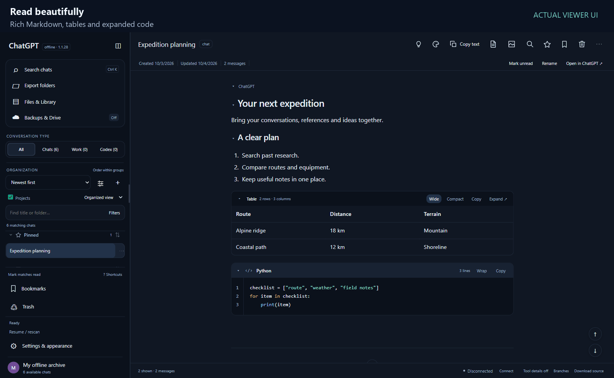
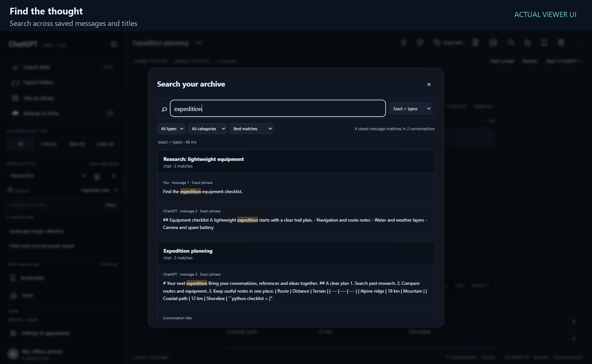
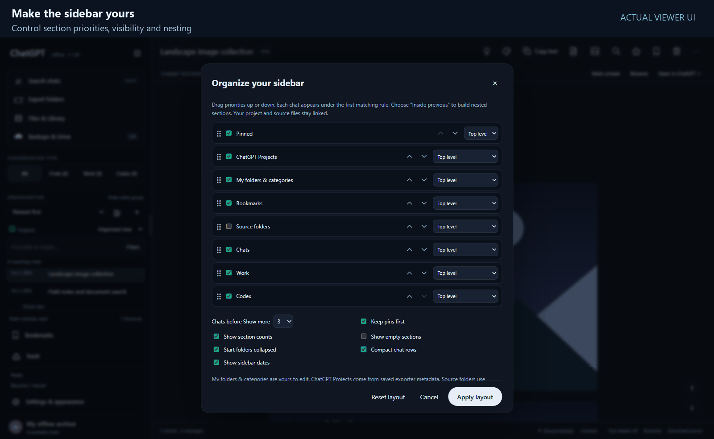
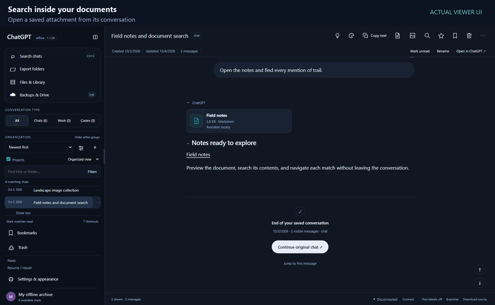
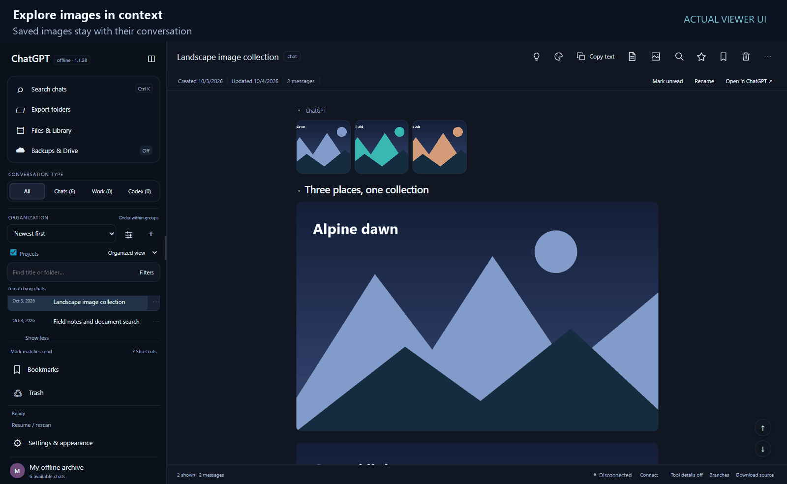
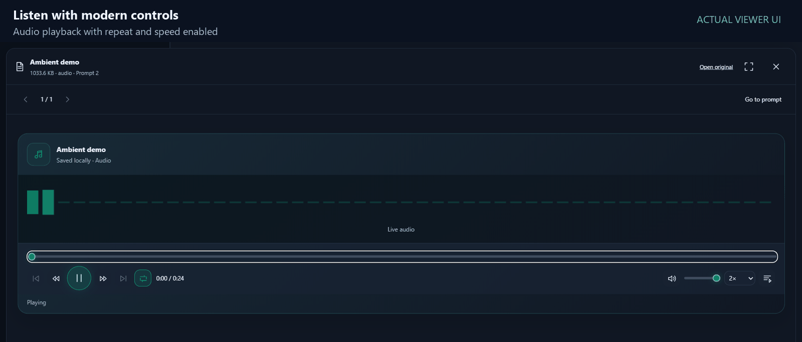
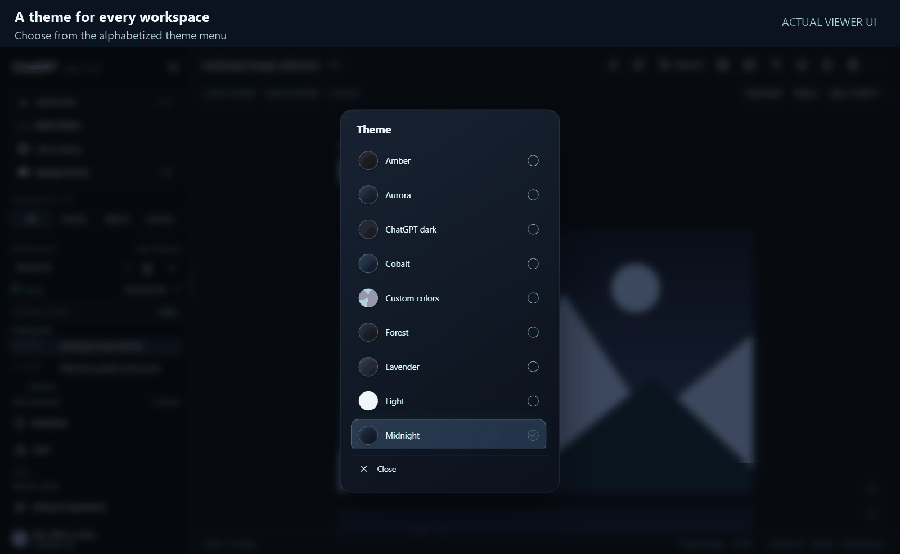
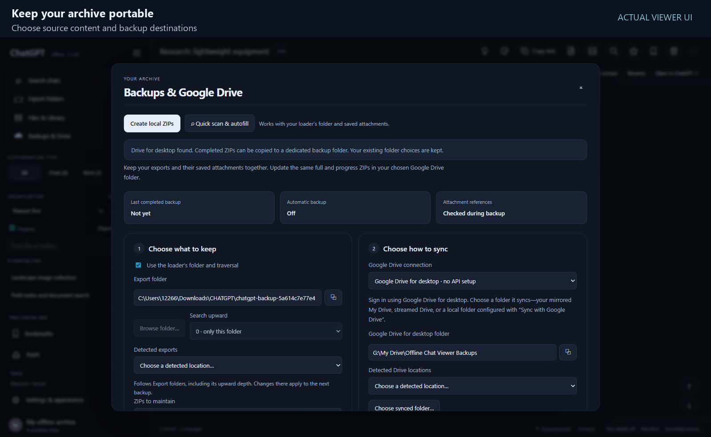

# Interface gallery

[Back to the homepage](../README.md) · [Download the Viewer](https://github.com/kitomisaitichi-design/chatgpt-viewer/releases/latest)

Eight actual interface walkthroughs captured from Offline Chat Viewer 1.1.28 with a separate demonstration archive. Chat text, landscape studies and the short audio tone are sample content. Captures are 1600 pixels wide, with explanatory captions outside the interface. The GIFs show selected UI states and interactions; they are edited walkthroughs rather than continuous real-time recordings. Open any animation for full resolution.

## Read beautifully

Rich Markdown, tables and expanded code → Collapse code without losing your place → Expand saved sections in one click → Read syntax-highlighted code alongside the table.

## Find the thought

Search across saved messages and titles → Change the query to narrow the archive → Review highlighted matches across conversations → Jump directly to the matching message.

## Make the sidebar yours

Control section priorities, visibility and nesting → Choose row counts and date display → Apply the layout without changing source files → Unpin a conversation → Pin it again for quick access.

## Search inside your documents

Open a saved attachment from its conversation → Read the locally rendered document → Find text with a persistent match counter → Move to the next occurrence → Switch to whole-word matching → Continue through the document.

## Explore images in context

Saved images stay with their conversation → Open the full thread image viewer → Move to the next available image → Continue through the collection → Wrap from the last image back to the first.

## Listen with modern controls

Audio playback with repeat and speed enabled → Pause playback → Change repeat and playback speed → Resume local audio playback.

## A theme for every workspace

Choose from the alphabetized theme menu → Aurora across the entire interface → Light for daytime reading → Midnight for a calm dark workspace.

## Keep your archive portable

Choose source content and backup destinations → Configure cadence, idle and power rules → Import saved ZIPs and restore organization.

## More features to explore

These demos complement the [complete feature catalog](../README.md#feature-catalog): branch/message-version navigation, ChatGPT/Work/Codex source types, project metadata, bookmarks, reversible Trash, citations, supported charts/widgets, PDF and Office previews, HTML rendering, optional local semantic search, native browser connection and optional silent release updates. Availability depends on saved source data and the file format.

Backup footage demonstrates configuration only. No cloud upload, remote deletion or optional semantic-engine setup is claimed by these captures.
